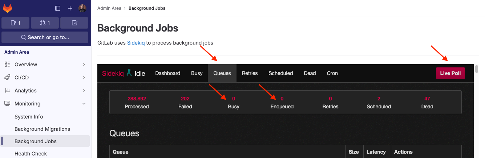

# Configure the GitLab chart with an external Gitaly

This document intends to provide documentation on how to configure this Helm chart with an external Gitaly service.

If you don't have Gitaly configured, for on-premise or deployment to VM,
consider using our [Linux package](external-omnibus-gitaly.md).

NOTE:
External Gitaly _services_ can be provided by Gitaly nodes, or
[Praefect](https://docs.gitlab.com/ee/administration/gitaly/praefect.html) clusters.

## Configure the chart

Disable the `gitaly` chart and the Gitaly service it provides, and point the other services to the external service.

You need to set the following properties:

- `global.gitaly.enabled`: Set to `false` to disable the included Gitaly chart.
- `global.gitaly.external`: This is an array of [external Gitaly service(s)](../../charts/globals.md#external).
- `global.gitaly.authToken.secret`: The name of the [secret which contains the token for authentication](../../installation/secrets.md#gitaly-secret).
- `global.gitaly.authToken.key`: The key within the secret, which contains the token content.

The external Gitaly services will make use of their own instances of GitLab Shell.
Depending your implementation, you can configure those with the secrets from this
chart, or you can configure this chart's secrets with the content from a predefined
source.

You **may** need to set the following properties:

- `global.shell.authToken.secret`: The name of the [secret which contains secret for GitLab Shell](../../installation/secrets.md#gitlab-shell-secret).
- `global.shell.authToken.key`: The key within the secret, which contains the secret content.

A complete example configuration, with two external services (`external-gitaly.yml`):

```yaml
global:
  gitaly:
    enabled: false
    external:
      - name: default                   # required
        hostname: node1.git.example.com # required
        port: 8075                      # optional, default shown
      - name: praefect                  # required
        hostname: ha.git.example.com    # required
        port: 2305                      # Praefect uses port 2305
        tlsEnabled: false               # optional, overrides gitaly.tls.enabled
    authToken:
      secret: external-gitaly-token     # required
      key: token                        # optional, default shown
    tls:
      enabled: false                    # optional, default shown
```

Example installation using the above configuration file in conjunction other
configuration via `gitlab.yml`:

```shell
helm upgrade --install gitlab gitlab/gitlab  \
  -f gitlab.yml \
  -f external-gitaly.yml
```

## Multiple external Gitaly

If your implementation uses multiple Gitaly nodes external to these charts,
you can define multiple hosts as well. The syntax is slightly different, as
to allow the complexity required.

An [example values file](https://gitlab.com/gitlab-org/charts/gitlab/blob/master/examples/gitaly/values-multiple-external.yaml) is provided, which shows the
appropriate set of configuration. The content of this values file is not
interpreted correctly via `--set` arguments, so should be passed to Helm
with the `-f / --values` flag.

### Connecting to external Gitaly over TLS

If your external [Gitaly server listens over TLS port](https://docs.gitlab.com/ee/administration/gitaly/#enable-tls-support),
you can make your GitLab instance communicate with it over TLS. To do this, you
have to

1. Create a Kubernetes secret containing the certificate of the Gitaly
   server

   ```shell
   kubectl create secret generic gitlab-gitaly-tls-certificate --from-file=gitaly-tls.crt=<path to certificate>
   ```

1. Add the certificate of external Gitaly server to the list of
   [custom Certificate Authorities](../../charts/globals.md#custom-certificate-authorities)
   In the values file, specify the following

   ```yaml
   global:
     certificates:
       customCAs:
         - secret: gitlab-gitaly-tls-certificate
   ```

   or pass it to the `helm upgrade` command using `--set`

   ```shell
   --set global.certificates.customCAs[0].secret=gitlab-gitaly-tls-certificate
   ```

1. To enable TLS for all Gitaly instances, set `global.gitaly.tls.enabled: true`.

   ```yaml
   global:
     gitaly:
       tls:
         enabled: true
   ```

   To enable for instances individually, set `tlsEnabled: true` for that entry.

   ```yaml
   global:
     gitaly:
       external:
         - name: default
           hostname: node1.git.example.com
           tlsEnabled: true
   ```

NOTE:
You can choose any valid secret name and key for this, but make
sure the key is unique across all the secrets specified in `customCAs` to avoid
collision since all keys within the secrets will be mounted. You **do not**
need to provide the key for the certificate, as this is the _client side_.

## Test that GitLab can connect to Gitaly

To check that GitLab can connect to the external Gitaly server:

```shell
kubectl exec -it <toolbox-pod> -- gitlab-rake gitlab:gitaly:check
```

If you are using Gitaly with TLS, you can also check if GitLab Chart trusts the Gitaly certificate:

```shell
kubectl exec -it <toolbox-pod> -- echo | /usr/bin/openssl s_client -connect <gitaly-host>:<gitaly-port>
```

## Migrate from Gitaly chart to external Gitaly

If you are using the Gitaly Chart to provide the Gitaly service and you need to migrate all of your
repositories to an external Gitaly service, you can back up your repositories from the Gitaly
chart PersistentVolumeClaim (PVC) and then restore them to the external Gitaly service.

This operation:

- Does incur downtime to all users.
- Has not been tested with the [Praefect chart](../../charts/gitlab/praefect/index.md) and is not supported.

### Step 1: Get the current release revision of the GitLab Chart

In the unlikely event that something goes wrong during the migration, get the current release
revision of the GitLab Chart. Copy the output and put it aside just in case we need to perform a
[rollback](#rollback):

```shell
helm history <release> --max=1
```

### Step 2: Setup external Gitaly Service or Gitaly Cluster

Set up an [external Gitaly](https://docs.gitlab.com/ee/administration/gitaly/configure_gitaly.html)
or [external Gitaly Cluster](https://docs.gitlab.com/ee/administration/gitaly/praefect.html). You must
provide the Gitaly token and GitLab Shell secret from your Chart installation as part of those steps:

```shell
# Get the GitLab Shell secret
kubectl get secret <release>-gitlab-shell-secret -ojsonpath='{.data.secret}' | base64 -d

# Get the Gitaly token
kubectl get secret <release>-gitaly-secret -ojsonpath='{.data.token}' | base64 -d
```

::Tabs

:::TabTitle Gitaly

- The Gitaly token extracted here should be used for the `AUTH_TOKEN` value.
- The GitLab Shell secret extracted here should be used for the `shellsecret` value.

:::TabTitle Gitaly Cluster

- The Gitaly token extracted here should be used for the `PRAEFECT_EXTERNAL_TOKEN`.
- The GitLab Shell secret extracted here should be used for the `GITLAB_SHELL_SECRET_TOKEN`.

::EndTabs

### Step 3: Verify no Git changes can be made during migration

To ensure the data integrity of the migration, prevent any changes from being made to your Git
repositories in the following steps:

**1. Enable Maintenance Mode**

If you are using GitLab Enterprise Edition, enable [maintenance mode](https://docs.gitlab.com/ee/administration/maintenance_mode/#enable-maintenance-mode) either through the UI, API or the Rails console:

```shell
kubectl exec <toolbox pod name> -it -- gitlab-rails runner 'Gitlab::CurrentSettings.update!(maintenance_mode: true)'
```

**2. Scale down Runner pods**

If you are using GitLab Community Edition, you must scale down any GitLab Runner pods that are running in the cluster. This prevents
the Runners from connecting to GitLab to process CI/CD jobs.

If you are using GitLab Enterprise Edition, this step is optional because [maintenance mode](https://docs.gitlab.com/ee/administration/maintenance_mode/#enable-maintenance-mode)
prevents Runners in the cluster from connecting to GitLab.

```shell
# Make note of the current number of replicas for Runners so we can scale up to this number later
kubectl get deploy -lapp=gitlab-gitlab-runner,release=<release> -o jsonpath='{.items[].spec.replicas}{"\n"}'

# Scale down the Runners pods to zero
kubectl scale deploy -lapp=gitlab-gitlab-runner,release=<release> --replicas=0
```

**3. Confirm no CI jobs are running**

In the Admin Area, go to **CI/CD > Jobs**. This page shows you all jobs, but confirm that there are no jobs with the **Running** status. You need to wait for the jobs to complete before proceeding to the next step.

**4. Disable Sidekiq cron jobs**

To prevent Sidekiq jobs from being scheduled and executed during the migration, disable all Sidekiq cron jobs:

```shell
kubectl exec <toolbox pod name> -it -- gitlab-rails runner 'Sidekiq::Cron::Job.all.map(&:disable!)'
```

**5. Confirm no background jobs are running**

We need to wait for any enqueued or in progress jobs to complete before proceeding to the next step.

1. In the Admin Area, go to [**Monitoring**](https://docs.gitlab.com/ee/administration/admin_area.html#background-jobs) and select **Background Jobs**. 
1. Under the Sidekiq dashboard, select **Queues** and then **Live Poll**.
1. Wait for **Busy** and **Enqueued** to drop to 0.
      
   

**6. Scale down Sidekiq and Webservice pods**

Scale down the Sidekiq and Webservice pods to ensure that a consistent backup is taken. Both services are scaled
up at a later stage:

- The Sidekiq pods are scaled back up during the restore step
- The Webservice pods are scaled back up after switching to the external Gitaly service to test connectivity

```shell
# Make note of the current number of replicas for Sidekiq and Webservice so we can scale up to this number later
kubectl get deploy -lapp=sidekiq,release=<release> -o jsonpath='{.items[].spec.replicas}{"\n"}'
kubectl get deploy -lapp=webservice,release=<release> -o jsonpath='{.items[].spec.replicas}{"\n"}'

# Scale down the Sidekiq and Webservice pods to zero
kubectl scale deploy -lapp=sidekiq,release=<release> --replicas=0
kubectl scale deploy -lapp=webservice,release=<release> --replicas=0
```

**7. Restrict external connections to the cluster**

To prevent users and external GitLab Runners from making any changes to GitLab, we need to restrict all
unnecessary connections to GitLab.

Once these steps are completed, GitLab is completely unavailable in the browser until the restore is completed.

In order to keep the cluster accessible to the new external Gitaly service during the migration, we must add the
IP address for the external Gitaly service to the `nginx-ingress` configuration as the only external exception.

1. Create a `ingress-only-allow-ext-gitaly.yml` file with the following content:

   ```yaml
   nginx-ingress:
     controller:
       service:
         loadBalancerSourceRanges:
          - "x.x.x.x/32"
   ```

   `x.x.x.x` should be the IP address of the external Gitaly service.

1. Apply the new configuration using both `gitlab.yml` and `ingress-only-allow-ext-gitaly.yml` files:

    ```shell
    helm upgrade <release> gitlab/gitlab \
      -f gitlab.yml \
      -f ingress-only-allow-ext-gitaly.yml
    ```

**8. Create list of repository checksums**

Prior to running the backup, [check all GitLab repositories](https://docs.gitlab.com/ee/administration/raketasks/check.html#check-all-gitlab-repositories)
and create a list of repository checksums. Pipe the output to a file so we can `diff` the checksums after the migration:

```shell
kubectl exec <toolbox pod name> -it -- gitlab-rake gitlab:git:checksum_projects > ~/checksums-before.txt
```

### Step 4: Backup all repositories

[Create a backup](../../backup-restore/backup.md#create-the-backup) of your repositories only:

```shell
kubectl exec <toolbox pod name> -it -- backup-utility --skip artifacts,ci_secure_files,db,external_diffs,lfs,packages,pages,registry,terraform_state,uploads
```

### Step 5: Configure Instance to use new Gitaly Service

1. Disable the Gitaly subchart and configure GitLab to use the external Gitaly.
   If there are any Gitaly references in your main `gitlab.yml` configuration file, remove those
   and create a new `external-gitaly.yml` file with the following content.

   If you have previously defined additional Gitaly storages, you need to ensure a matching Gitaly
   storage with the same name is specified in the new configuration, otherwise the restore operation
   fails.

   Refer to the
   [connecting to external Gitaly over TLS](#connecting-to-external-gitaly-over-tls) section if you
   are configuring TLS:

   ::Tabs

   :::TabTitle Gitaly

   ```yaml
   global:
     gitaly:
       enabled: false
       external:
         - name: default                   # required
           hostname: node1.git.example.com # required
           port: 8075                      # optional, default shown
           tlsEnabled: false               # optional, overrides gitaly.tls.enabled
   ```

   :::TabTitle Gitaly Cluster

   ```yaml
   global:
     gitaly:
       enabled: false
       external:
         - name: default                   # required
           hostname: ha.git.example.com    # required
           port: 2305                      # Praefect uses port 2305
           tlsEnabled: false               # optional, overrides gitaly.tls.enabled
   ```

   ::EndTabs

1. Apply the new configuration using the `gitlab.yml`, `ingress-only-allow-ext-gitaly.yml`, and `external-gitaly.yml` files:

    ```shell
    helm upgrade --install gitlab gitlab/gitlab \
      -f gitlab.yml \
      -f ingress-only-allow-ext-gitaly.yml \
      -f external-gitaly.yml
    ```

1. Scale up your Webservice pods to the original replica count if they aren't running. This is required so we can test the
   GitLab to external Gitaly connection in the following steps.

   ```shell
   kubectl scale deploy -lapp=webservice,release=<release> --replicas=<value>
   ```

1. On the Toolbox pod, confirm that GitLab can connect to the external Gitaly successfully:

   ```shell
   kubectl exec <toolbox pod name> -it -- gitlab-rake gitlab:gitaly:check
   ```

1. Ensure that the external Gitaly can connect back to your Chart install:

   ::Tabs

   :::TabTitle Gitaly

   Ensure that the Gitaly service can perform callbacks to the GitLab API successfully:

   ```shell
   sudo /opt/gitlab/embedded/bin/gitaly check /var/opt/gitlab/gitaly/config.toml
   ```

   :::TabTitle Gitaly Cluster

   On all Praefect nodes, ensure that the Praefect service can connect to the Gitaly nodes:

   ```shell
   # Run on Praefect nodes
   sudo /opt/gitlab/embedded/bin/praefect -config /var/opt/gitlab/praefect/config.toml dial-nodes
   ```

   On all Gitaly nodes, ensure that the Gitaly service can perform callbacks to the GitLab API
   successfully:

   ```shell
   # Run on Gitaly nodes
   sudo /opt/gitlab/embedded/bin/gitaly check /var/opt/gitlab/gitaly/config.toml
   ```

   ::EndTabs

### Step 6: Restore and validate repository backup

1. [Restore the backup file](../../backup-restore/restore.md#restoring-the-backup-file) created previously.
   As a result, the repositories are copied to the configured external Gitaly or Gitaly Cluster.

1. [Check all GitLab repositories](https://docs.gitlab.com/ee/administration/raketasks/check.html#check-all-gitlab-repositories)
   and create a list of repository checksums. Pipe the output to a file so we can `diff` the checksums in the next step:

   ```shell
   kubectl exec <toolbox pod name> -it -- gitlab-rake gitlab:git:checksum_projects  > ~/checksums-after.txt
   ```

1. Compare the repository checksums before and after the repository migration. If the checksums are identical, this command
   returns no output:

   ```shell
   diff ~/checksums-before.txt ~/checksums-after.txt
   ```

   If you observe a blank checksum changing to `0000000000000000000000000000000000000000` in the `diff` output for a specific line,
   this is expected and can be safely ignored.

### Step 7: Final configuration and validation

1. To allow external users and GitLab Runners to connect to GitLab again, apply the `gitlab.yml` and `external-gitaly.yml` files. As
   we aren't specifying `ingress-only-allow-ext-gitaly.yml`, it removes the IP restrictions:

    ```shell
    helm upgrade <release> gitlab/gitlab \
      -f gitlab.yml \
      -f external-gitaly.yml
    ```

    Consider generating a consolidated `gitlab.yml` for the future that includes the external Gitaly configuration:

    ```shell
    helm get values <release> gitlab/gitlab -o yaml > gitlab.yml
    ```

1. If you are using GitLab Enterprise Edition, disable [maintenance mode](https://docs.gitlab.com/ee/administration/maintenance_mode/#enable-maintenance-mode) either through the UI, API or the Rails console:

   ```shell
   kubectl exec <toolbox pod name> -it -- gitlab-rails runner 'Gitlab::CurrentSettings.update!(maintenance_mode: false)'
   ```

1. If you have multiple Gitaly storages, [configure where new repositories are stored](https://docs.gitlab.com/ee/administration/repository_storage_paths.html#configure-where-new-repositories-are-stored).

1. Enable Sidekiq cron jobs:

   ```shell
   kubectl exec <toolbox pod name> -it -- gitlab-rails runner 'Sidekiq::Cron::Job.all.map(&:enable!)'
   ```

1. Scale up your Runner pods to the original replica count if they aren't running:

   ```shell
   kubectl scale deploy -lapp=gitlab-gitlab-runner,release=<release> --replicas=<value>
   ```

1. After you have confirmed everything is working as expected, you can delete the Gitaly PVC:

   WARNING: Do not delete the Gitaly PVC until you have confirmed the checksums match as per [step 6](#step-6-restore-and-validate-repository-backup) and
  double checked that everything is working as expected.

   ```shell
   kubectl delete pvc repo-data-<release>-gitaly-0
   ```

### Rollback

If you run into any problems, you can rollback the changes made so the Gitaly subchart is used again.

The original Gitaly PVC must exist to rollback successfully.

1. Rollback the GitLab Chart to the previous release using the revision number obtained
in [Step 1: Get the current release revision of the GitLab Chart](#step-1-get-the-current-release-revision-of-the-gitlab-chart):

   ```shell
   helm rollback <release> <revision>
   ```

1. Scale up your Webservice pods to the original replica count if they aren't running:

   ```shell
   kubectl scale deploy -lapp=webservice,release=<release> --replicas=<value>
   ```

1. Scale up your Sidekiq pods to the original replica count if they aren't running:

   ```shell
   kubectl scale deploy -lapp=sidekiq,release=<release> --replicas=<value>
   ```

1. Enable Sidekiq cron jobs if you previously disabled them:

   ```shell
   kubectl exec <toolbox pod name> -it -- gitlab-rails runner 'Sidekiq::Cron::Job.all.map(&:enable!)'
   ```

1. Scale up your Runner pods to the original replica count if they aren't running:

   ```shell
   kubectl scale deploy -lapp=gitlab-gitlab-runner,release=<release> --replicas=<value>
   ```

1. If you are using GitLab Enterprise Edition, disable [maintenance mode](https://docs.gitlab.com/ee/administration/maintenance_mode/#disable-maintenance-mode)
   if it is enabled.

### Related documentation

- [Migrate to Gitaly Cluster](https://docs.gitlab.com/ee/administration/gitaly/index.html#migrate-to-gitaly-cluster)
