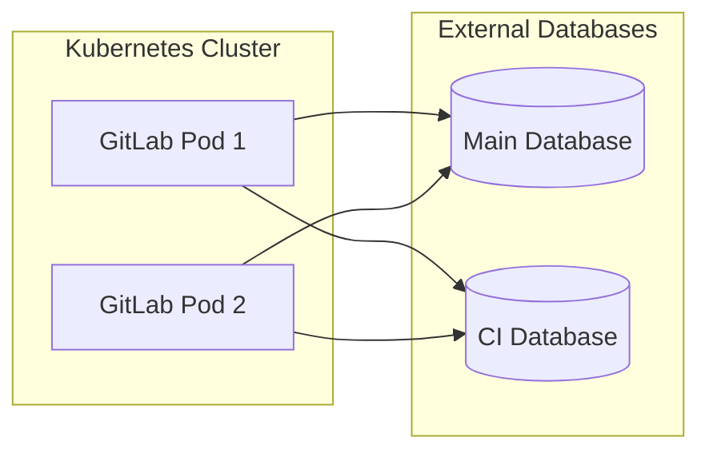

# Configure the GitLab chart with multiple external databases (Alpha)

WARNING:
This feature is not ready for production use. Due to [known issues](https://docs.gitlab.com/ee/administration/postgresql/multiple_databases.html#known-issues), configuring GitLab with multiple databases is in [**Alpha**](https://docs.gitlab.com/ee/policy/alpha-beta-support.html#alpha-features).

By default, GitLab uses a single application database, referred to as the `main` database.

To scale GitLab, you can configure GitLab to use multiple external application databases,
namely `main` and `ci`. The following diagram shows how the pods talk to the multiple databases:



Prerequisites:

- All prerequisites listed in the [external database document](../external-db/index.md).
- An additional empty `gitlabhq_production_ci` database, which can be running on the same PostgreSQL
  server as the `gitlabhq_production` database.
- Access to the Kubernetes cluster using
  the [`kubectl`](https://kubernetes.io/docs/reference/kubectl/) and [`helm`](https://helm.sh/docs/intro/install/)
  CLI tools. Refer to the [GitLab chart prerequisites](../../installation/tools.md) for more information.

To set up multiple external databases:

1. Create the Kubernetes secret that holds the PostgreSQL secrets for the database user `gitlab`.
   This password can be different, to support having the multiple databases on two different physical servers
   with different passwords.

   Let's choose the name `gitlab-postgresql-password` for this Kubernetes secret:

   ```shell
   kubectl create secret generic gitlab-postgresql-password \
       --from-literal=main-gitlab-password=<main-database-password> \
       --from-literal=ci-gitlab-password=<ci-database-password>
   ```

1. Add the following to your existing YAML file that you use to
   [deploy the GitLab chart](../../installation/deployment.md)
   (for example `gitlab-values.yaml`), and replace the `host` values with yours:

   ```yaml
   global:
     psql:
       main:
         host: main.database.host # set this to the host of your external main database
         database: gitlabhq_production
         password:
           secret: gitlab-postgresql-password
           key: main-gitlab-password
       ci:
         host: ci.database.host # set this to the host of your external ci database. Can be the same as the one for main database
         database: gitlabhq_production_ci # difference in database containing CI schema, results in `database_tasks: true` as well
         password:
           secret: gitlab-postgresql-password
           key: ci-gitlab-password
   postgresql:
     install: false
   ```

   Where:

    - `postgresql.install`: Set to `false` to disable the embedded database, and use the external database instead.
    - `global.psql.main.host`: Set to the hostname of the external `main` database, can be a domain or an IP address.
    - `global.psql.main.password.secret`: The name of the Kubernetes secret, that was used to hold the PostgreSQL user.
      In our example it's `gitlab-postgresql-password`.
    - `global.psql.main.password.key`: Within the secret, the key that contains the password.
      In our example it's `main-gitlab-password`.
    - `global.psql.ci.host`: Set to the hostname of the external `ci` database, can be a domain or an IP address. It can be the
      same value as `global.psql.main.host` if both databases `main` and `ci` are on the same database server.
    - `global.psql.ci.password.secret`: The name of the Kubernetes secret, that was used to hold the PostgreSQL user.
      In our example it's `gitlab-postgresql-password`.
    - `global.psql.ci.password.key`: Within the secret, the key that contains the password.
      In our example it's `ci-gitlab-password`.

1. Finally, deploy the GitLab chart using `gitlab-values.yaml`:

   ```shell
   helm repo add gitlab https://charts.gitlab.io/
   helm repo update
   helm upgrade --install gitlab gitlab/gitlab --timeout=900s -f gitlab-values.yaml
   ```
